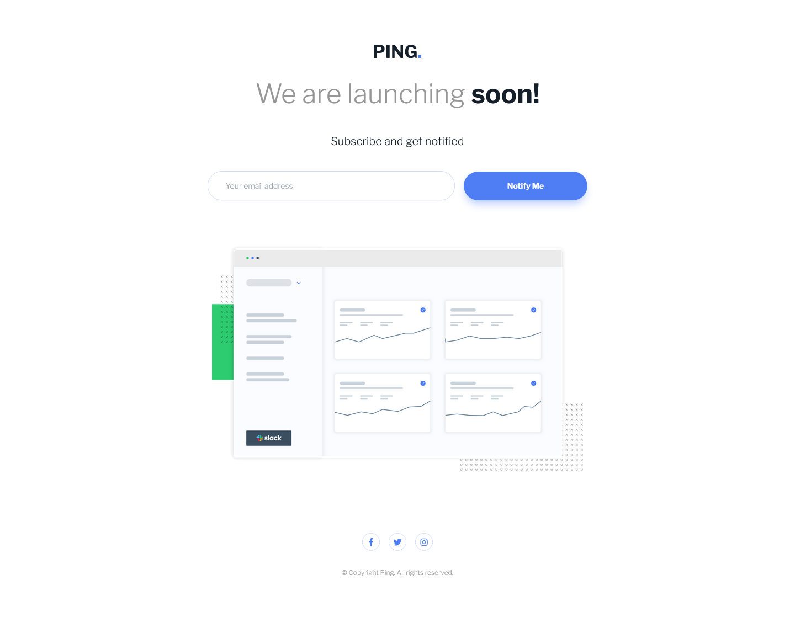

# Frontend Mentor - Ping coming soon page solution

This is a solution to the [Ping coming soon page challenge on Frontend Mentor](https://www.frontendmentor.io/challenges/ping-single-column-coming-soon-page-5cadd051fec04111f7b848da).

## Table of contents

- [Overview](#overview)
  - [The challenge](#the-challenge)
  - [Screenshot](#screenshot)
  - [Links](#links)
- [My process](#my-process)
  - [Built with](#built-with)
  - [What I learned](#what-i-learned)
  - [Continued development](#continued-development)
  - [Useful resources](#useful-resources)
- [Author](#author)
- [Acknowledgments](#acknowledgments)

## Overview

### The challenge

Users should be able to:

- View the optimal layout for the site depending on their device's screen size
- See hover states for all interactive elements on the page
- Submit their email address using an `input` field
- Receive an error message when the `form` is submitted if:
	- The `input` field is empty. The message for this error should say *"Whoops! It looks like you forgot to add your email"*
	- The email address is not formatted correctly (i.e. a correct email address should have this structure: `name@host.tld`). The message for this error should say *"Please provide a valid email address"*

### Screenshot



### Links

- Solution URL: [FrontendMentor.io]()
- Live Site URL: [Vercel](https://prj-03-ping-single-column-coming-soon-page.vercel.app/)

## My process

### Built with

- Semantic HTML5 markup
- CSS custom properties
- Flexbox
- CSS Grid
- Mobile-first workflow

### What I learned

How to change styles in Javscript with Tailwind.css.

```js
import "./style.css";

const validEmailFormat = /^\D\w*[.]*\w*@\w*[.]\w*/;
const emailInput = document.getElementById("email");
const emailMissingLabel = document.getElementById("email-missing");
const emailInvalidLabel = document.getElementById("email-invalid");
const submitButton = document.getElementById("submit-button");

emailInput.addEventListener("focus", (e) => {
  emailMissingLabel.classList.replace("block", "hidden");
  emailInvalidLabel.classList.replace("block", "hidden");
  emailInput.style.borderColor ="hsl(223, 100%, 88%)";
});

submitButton.addEventListener("click", (e) => {
  if (!emailInput.value) {
    emailMissingLabel.classList.replace("hidden", "block");
    emailInput.style.borderColor = "hsl(354, 100%, 66%)";

  } else if (!validEmailFormat.test(emailInput.value)) {
    emailInvalidLabel.classList.replace("hidden", "block");
    emailInput.style.borderColor = "hsl(354, 100%, 66%)";
  } else {
    emailInput.value = "";
  }
});
```

### Continued development

Future projects will be developed using TailwindCSS and vanilla Javascript when interactivity must be included.

### Useful resources

- [ViteJS Public Directory](https://vitejs.dev/guide/assets.html#the-public-directory)
- [TailwindCSS Directives](https://tailwindcss.com/docs/functions-and-directives) - Use of @apply directive
- [Customizing Colors in TailwindCSS](https://tailwindcss.com/docs/customizing-colors) - Adding personalized color names to be used in tailwindcss.
- [Customizing Fonts in TailwindCSS](https://tailwindcss.com/docs/font-family#using-custom-values) - Adding Google fonts to be used in tailwindcss.

## Author

- Website - [Gustavo Sanchez](https://www.gusanche.dev)
- Frontend Mentor - [@gusanchedev](https://www.frontendmentor.io/profile/gusanchedev)
- Github - [@gusanchedev](https://www.github.com/gusanchedev)
- Twitter - [@gusanchedev](https://www.twitter.com/gusanchedev)
- Linkedin - [gusanchedev](https://www.linkedin.com/in/gusanchedev/)

## Acknowledgments

Thanks to Mariapaz for being my friend and support 💙
